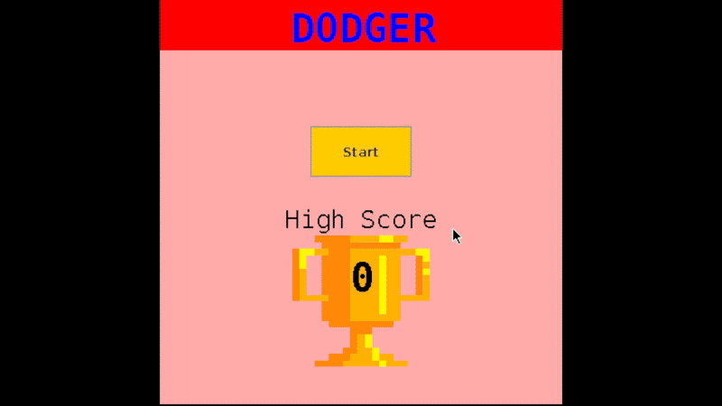

# Java Dodge Game

A 2D game written entirely in Java where the player controls a stick figure and must dodge incoming missiles by jumping or crouching. The game increases in difficulty over time as missiles progressively speed up, testing reaction time and precision.

## Gameplay Overview
- Start screen displays the current high score
- Player must avoid missiles aimed at the character
- Controls include jumping and crouching to dodge attacks
- Colliding with a missile ends the game and returns the player to the start screen
- Missile speed increases over time to scale difficulty

## Technologies Used
- Java
- Object-Oriented Programming (OOP)
- Game loop and real-time input handling

## What I Learned
- Managing game state transitions (start screen, active game, game over)
- Implementing increasing difficulty through dynamic speed scaling
- Structuring a Java project using reusable classes and clean logic
- Debugging timing and collision detection issues

## Play the Game
- Click on the link to play the game
- Use up and down arrow keys to jump and crouch
- https://codehs.com/sandbox/id/stickman-dodge-V3PDpo
